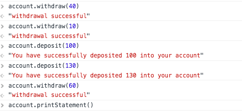
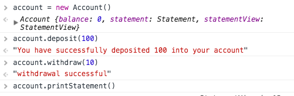
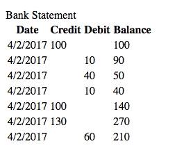
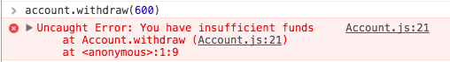

# Bank Test

User Stories
============

```

As a user
So I can store my money in a safe place
I would like to make a deposit into my bank Account

As a User
So I can take out extra money when I need to
I would like to make a withdrawal from my bank Account

As a User
So I can keep track of my bank balance
I would like to see a statement of all my transactions and current balance

```

Specification
=============

* Deposits, withdrawal
* Account statement (date, amount, balance) printing.
* Data can be kept in memory

Approach and Technologies used
==============================

* Code written in Javascript
* Testing using jasmine

The project uses four main classes:

**Account** responsible for making deposits, withdrawals and printing the statement.

**Statement** responsible for storing all of the transactions from the account.

**StatementView** responsible for formatting the statement into a HTML view.

**Transaction** responsible for the amount, type and date of each transaction.

Instructions and Installation
=============================

1. Fork and clone this repo
2. Open SpecRunner.html file into any browser. It should be ./yourPath/index.html
3. You will then need to open the developer tools which can be done by pressing ```F12``` or ```cmd+alt+i``` on a Mac.

4. Create a new account by entering ``` account = new Account ``` where account is a variable. Then use the following commands:

* To make a deposit: ``` account.deposit(amount)```

* To withdraw: ``` account.withdraw(amount) ```

* To check the current balance: ``` account.balance```

* To print the statement: ``` account.printStatement() ```

Example
=======

Making a new account, depositing and withdrawing:





Prints a statement of all the transactions by date, type and amount. Then displays current balance:



Throws an error when you try to withdraw an amount greater than your current balance:




Further Features
================

* PIN authentication from user
